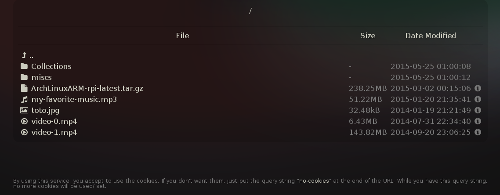
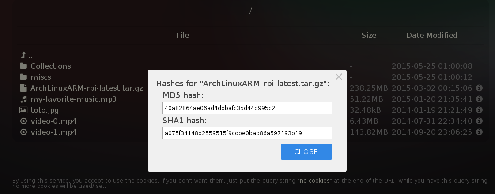

Directory Lister
================
List easily your directories like if you were using [SimpleHTTPServer](https://docs.python.org/2/library/simplehttpserver.html) but with
your customizations!

Index:
======
1. [Introduction](#1-introduction)
2. [Requirements](#2-requirements)
3. [Installation](#3-installation)
4. [Configuration](#4-configuration)
5. [HTML Template Tokens](#5-html-template-tokens)
6. [Usage](#6-usage)
7. [Licenses](#7-licenses)
8. [Screenshots](#8-screenshots)

### 1. Introduction:
`Directory Lister` is a project with the main aim to improve the [SimpleHTTPServer](https://docs.python.org/2/library/simplehttpserver.html)
available on Python, which can list the files and directories in the current working directory. But sometimes, often when we need to give
an access to any users who want a little bit more design web page `Directory Lister` can do that for you!

`Directory Lister` suggests the possibility to customize the HTML page, the CSS, JS and others resources. But one of the imposed limits
for this project was to only have one file and no external dependencies (like Makotemplates, Flask, etc.), making the possibility to use this project with only one file to make easily movable and then
by making this one "portable". But, we can not have only one file to make the templates, the CSS, JS, etc. Then we have the configuration files or
the arguments when you run this script which allows you to set a path where are the HTML, CSS, etc. And if you do not have the time you can
just run this script which already have few default settings.

### 2. Requirements:
This project requires a Python2 (only, at least for the moment) greater or equal than __2.7__.

### 3. Installation:
After cloned this repository (`git clone http://github.com/NyanKiyoshi/directory-lister`) and changed your current directory to the new
one (directory-lister).
  - From a terminal you can run `python setup.py develop` which this command will create a link to this script also, you will need the root rights
to perform this action if this is not a Python VirtualEnv so there is another method like by changing the install directory
e.g.: py setup.py develop --install-dir ~/.local/lib/python2.7/site-packages/.

  - Or you can also run `python setup.py install` to install the files without linking them (more secure).
 
### 4. Configuration:
If you do not have to read all, you have an example into the directory `directory-lister/.config/`.

     usage: directory_lister.py [-h] [-c PATH] [-d DIRECTORY] [-p PORT]
                                [--body BODY] [--style CSS] [--js JS]
                                [--date FORMAT] [--binary] [--hashing]
                                [--max-hash-size MAX_FILE_SIZE_TO_HASH]
                                [--store-hashes] [--allow-hidden]
                                [--hidden HIDDEN_FILES] [--database PATH]
                                [--single-thread] [--hide-parent]
                                [--resources-directory DIRECTORY]
     
Arguments `command-line-argument` (`Configuration_file_equivalent`):

  - `-c PATH, --config PATH`
  
    The configuration file, useful if you don't want parse each parameters (will overwrite the others arguments).
    Example: `--config=/home/user/web/.config/config.json`

  - `-d DIRECTORY, --directory DIRECTORY` (`base_directory`)
  
    The root directory for listing (current working directory by default).

  - `-p PORT, --port PORT` (`port` as integer)
  
    The port number 8080 by default.

  - `--body PATH` (`body`)
  
    Path to a desired content body.

  - `--style PATH` (`css`)
  
    Path to a stylesheet file.

  - `--js PATH` (`js`)
  
    Path to the Javascript file.

  - `--date FORMAT` (`date_format`)
  
    The date format to use. Example: %Y-%m-%d %H:%M:%S will show something like:
2015-05-09 23:25:03 (see [here](https://docs.python.org/2.7/library/datetime.html#strftime-and-strptime-behavior) for more information).

  - `--binary` (`binary_prefix` as boolean)
  
    Using the binary or decimal units.

  - `--hashing` (`allow_access_to_hidden` as boolean)
  
    Must provide the hash file on demand or not.

  - `--max-hash-size MAX_FILE_SIZE_TO_HASH` (`max_file_size_to_hash`as integer)
  
    The maximal file size allowed to hash (in bytes), 250000000 bytes by default (210MB).

  - `--store-hashes` (`keep_hashes_cache`as boolean)
  
     Must keep the hashes in cache into a database (faster) or not.

  - `--allow-hidden` (`allow_access_to_hidden` as boolean)
  
     Allow the direct access to hidden files.

  - `--hidden HIDDEN_FILES` (`hidden_files` as list)
  
    Add an UNIX filename pattern to hide on match (this argument can be given as much you want).
    Example: --hidden .config/ --hidden \*hide_me\*

  - `--database PATH` (`database`)
  
    A path to a new sqlite database (in memory by default).

  - `--single-thread` (`singlethread` as boolean)

    If we should only use a single thread server or not and then process to requests one after one.

  - `--hide-parent` (`hide_parent` as boolean)

    Must hide the parent double dots (..) or not.

  - `--resources-directory DIRECTORY` (`resources_directory`)

    The resources directory. Useful to add resources on pages by using `?get=filename`.

### 5. HTML Template Tokens:
There is the list of the available tokens for the HTML template (case sensitive):

  * The `TOGGLE_[...]` returns a link to toggle the sorting:
     - `$TOGGLE_SORTING_MODIFICATION`   by modification date.
     - `$TOGGLE_SORTING_CREATION`       by creation date.
     - `$TOGGLE_SORTING_SIZE`           by size.
     - `$TOGGLE_SORTING_NAME`           by name.

  * The specifics which __only work into the loop token__ giving information about each files:
     - `$FILE_NAME`          the file name.
     - `$FILE_LINK`          the link to the file.
     - `$FILE_MODIFICATION`  the last modification date.
     - `$FILE_CREATION`      the creation date.
     - `$FILE_MIMETYPE`      the mimetype.
     - `$FILE_TYPE`          the file type (takes the first part of the mimetype, e.g.: if the mimetype is `text/plain` the file type will be `text`).
     - `$FILE_SIZE`          the size human readable in decimal or binary (see the configuration section).

  * Available blocs (insensitive case):
  
       * Specifics about the analyze:
       
         ```
             {{ loop }}
                 Instructions...
             {{ endloop }}
         ```
         
         Indicates to the script, "this is the place where you will paste the directory list and you will doing that, that and that", and these instructions will be repeated for each file and directory found.
         
         Into the `{{ loop }} ... {{ endloop }}` bloc you can also add these blocs:
         
         ```
             {{ if file }}
                 If this is a file I want to show that...
             {{ endif file }} 
         ```
         
         Or/ and:
         
          ```
              {{ if not file }}
                  If this is not a file (a dir) I want to show that...
              {{ endif not file }}
          ```

        * Bloc outside of the loop and not concerned about this one:
         ```
             {{ if error }}
                 Instructions...
             {{ endif }}
             {{ if no error }}
                 Instructions...
             {{ endif }}
         ```

         If there is an error (invalid or empty directory), we ignore the content into the bloc `## else:` until the `## endif` token. Also, we can show the error by using the %(ERROR_MESSAGE)s token.
         Else, if there is not error, then we follow the instructions and we ignore the error instructions.

### 6. Usage:
There is many methods to use this script, one of them is if you installed it (with setup.py develop or install) you can run `python2 -m directoryLister [ARGUMENTS]`.

You can also run the script from this command `python2 path_to_this_file/directory_lister.py [ARGUMENTS]`.

Or any other methods!


### 7. Licenses:
`Directory Lister` is under [MIT license](LICENSE) held by [NyanKiyoshi](https://github.com/NyanKiyoshi) the full license is available [here](LICENSE).

This script also uses a work of Ron Rothman under a [MIT license](https://github.com/RonRothman/mtwsgi/blob/master/LICENSE) from [here](https://github.com/RonRothman/mtwsgi/blob/master/mtwsgi.py).

### 8. Screenshots:
Screenshots using the example configuration.




